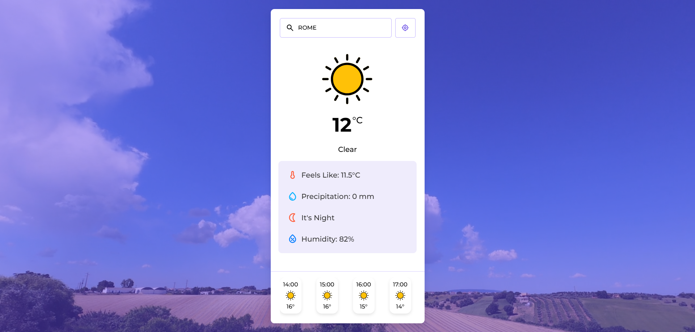

# 🌦️ Weather App

O Weather App é uma aplicação web moderna e responsiva que fornece informações meteorológicas em tempo real utilizando a [WeatherAPI](https://www.weatherapi.com/). Desenvolvido com HTML, CSS, JavaScript puro no front-end e Node.js com Express no back-end, o projeto permite que os usuários consultem o clima atual e a previsão para as próximas 24 horas de qualquer cidade. Com recursos como detecção de localização, exibição dinâmica de dados e integração entre front-end e back-end, o aplicativo oferece uma experiência intuitiva e funcional. Projetado para ser leve e eficiente, o Weather App destaca-se pelo design limpo, responsivo e pela implementação segura da API key no servidor.

### 🔗 Acesse o projeto: [Weather-App](https://weather-application-pedb.onrender.com/)

---

## 📸 Demonstração



---

## 📋 Funcionalidades

🔍 Busca por cidade: Digite o nome da cidade para obter informações climáticas.

📍 Localização atual: Utilize o botão para buscar o clima da sua localização.

🌡️ Informações exibidas:

- Temperatura atual

- Sensação térmica

- Umidade

- Precipitação

- Condição do tempo (ex.: Ensolarado, Chuvoso)

- Indicador de dia/noite

---

## 🛠️ Tecnologias Utilizadas

**Front-end:**  
  
  


**Back-end:**  
  


---

## 📁 Estrutura do Projeto
```
Weather-App/
├── weather-frontend/
│   ├── icons/
│   ├── videos/
│   ├── index.html
│   ├── style.css
│   └── script.js
│
└── weather-backend/
    ├── index.js
    ├── package.json
    └── package-lock.json
```
---

## ⚙️ Configuração Local

➊ Obtenha sua API key gratuitamente:

- Crie sua conta em [WeatherAPI](https://www.weatherapi.com/signup.aspx)

- Navegue até a seção [API key](https://www.weatherapi.com/my) e copie sua chave de API


➋ Clone o repositório e acesse o diretório do back-end:
```
git clone https://github.com/alex518123/weather-app.git

cd weather-app/weather-backend
```

➌  Instale as dependências:
```
npm install
```

➍ Crie o arquivo .env no diretório weather-backend e adicione sua API key:
```
WEATHER_API_KEY=sua_chave_da_api_aqui
```

➎ Execute o servidor:
```
node index.js
```

➏  Abra o front-end utilizando um servidor local:

- Abra o arquivo index.html no diretório weather-frontend usando um servidor local (como a extensão Live Server no VSCode).

- Isso evita problemas com requisições locais e CORS.

---

## 🔐 Segurança

A chave da API está protegida no back-end usando variáveis de ambiente.

As requisições do front-end são feitas ao servidor Express, evitando expor a chave diretamente.

---

## 🤝 Contribuições

Sinta-se à vontade para abrir issues ou pull requests! Qualquer ajuda é bem-vinda. 😄

---

## 📬 Contato

📧 **E-mail:** alexresende675@gmail.com

🐙 **GitHub:** [alex518123](https://github.com/alex518123)

---

## 📄 Licença

Este projeto está licenciado sob a [MIT License](https://opensource.org/licenses/MIT).

---

Desenvolvido por: Alexander Resende [Dê uma olhada no meu portfólio!]()